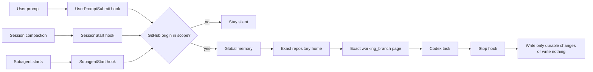
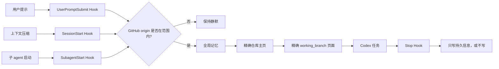

<div align="center">

# Codex Obsidian Memory

**Local-first, branch-aware long-term memory for Codex — organized in Obsidian.**

**面向 Codex 的本地优先、分支感知长期记忆，由 Obsidian 组织。**

[](https://github.com/Wang-Ruibin/codex-obsidian-memory/actions/workflows/ci.yml)
[](LICENSE)
[](https://www.python.org/)

[English](#english) · [中文](#中文) · [How it was built / 构建过程](docs/case-study.md) · [Security / 安全](SECURITY.md)

</div>

<a id="english"></a>

## English

Codex Obsidian Memory turns a plain Markdown vault into durable project context. Lifecycle hooks load the right notes before work, reload them after compaction and for subagents, then require a concise memory review before a task ends.

No vector database. No cloud memory service. No credentials in the vault.

> [!IMPORTANT]
> This project is an early public release. Back up an existing vault before adoption and review every hook in `/hooks` before trusting it.

## Why this exists

Agent memory often fails in one of two ways: it is too passive to load reliably, or too broad to keep projects and branches separated. This plugin uses deterministic lifecycle hooks plus a small, inspectable graph model:

- **Local-first** — memory remains in Markdown files you own.
- **Repository-scoped** — GitHub `origin` determines eligibility; ordinary folders stay silent.
- **Branch-aware** — only the page whose `working_branch` exactly matches the checkout is loaded.
- **Graph-friendly** — one repository, one folder, one project home; branch pages live beneath it.
- **Selective** — retain decisions, outcomes, reusable failures and next steps, not chat transcripts.
- **Reversible** — disable or uninstall the integration without deleting the vault.
- **Dependency-light** — Python standard library only.

## Quick start

### Requirements

- Codex CLI or Codex in the ChatGPT desktop app. Plugin installation is not currently available in the IDE extension.
- Python 3.11 or newer (`python3` on macOS/Linux, `py.exe` on Windows).
- Git repositories with a GitHub `origin`.
- Obsidian is recommended for browsing the graph, but the runtime uses ordinary Markdown.

### 1. Install the plugin

```bash
codex plugin marketplace add Wang-Ruibin/codex-obsidian-memory
codex plugin add codex-obsidian-memory@codex-obsidian-memory
```

Start a new Codex conversation after installation.

### 2. Create or adopt a vault

Ask Codex:

```text
Use $codex-obsidian-memory to initialize a vault at /absolute/path/to/my-memory
for GitHub owner my-account.
```

The setup is additive by default: existing files are skipped. It creates the vault template, stores local integration configuration, and can add the vault as a narrow writable root when Codex uses `workspace-write` sandboxing.

### 3. Trust and verify

1. Open `/hooks` and review the four plugin commands.
2. Trust the hook definition.
3. Start a new conversation inside an eligible GitHub repository.
4. Run `$codex-obsidian-memory status`, then `$codex-obsidian-memory validate`.

Healthy validation means zero missing required notes, duplicate project homes, duplicate branch identities, broken Wiki links and orphan nodes.

## How it works



The default graph has two clusters and one intentional bridge:

```text
Memory home ── global memory / maintenance / template
     │
     └── Project index ── repository home ── exact branch pages
```

See [the structure reference](plugins/codex-obsidian-memory/skills/codex-obsidian-memory/references/structure.md) for note identity rules.

## Repository scope

| Workspace | Default behavior |
|---|---|
| Configured GitHub owner, indexed repository | Load global memory, project home and exact branch page |
| Configured GitHub owner, new repository | Load global memory, index and template; register only when durable context exists |
| Explicitly included `OWNER/REPO` | Load even outside automatic owner scope |
| Explicitly excluded `OWNER/REPO` | Stay silent |
| Local-only repository, other Git host or ordinary folder | Stay silent |
| The vault itself | Load maintenance context |

Repository identity is read with non-mutating Git commands. SSH credentials, private keys, tokens and Git configuration secrets are never read into memory.

## Commands

Use the skill in Codex, or run `scripts/memoryctl.py` from the installed plugin root.

```text
status                         Show configuration and vault health
enable / disable               Toggle automatic behavior without deleting data
include OWNER/REPO             Add an explicit repository inclusion
exclude OWNER/REPO             Add an explicit repository exclusion
validate                       Check schema, identities and graph links
uninstall                      Remove plugin state and its own writable-root entry
```

`uninstall` never deletes or moves the vault. Remove the plugin itself afterwards with:

```bash
codex plugin remove codex-obsidian-memory@codex-obsidian-memory
```

## Adopt an existing vault

Do not force the English template over an established layout. Map its existing relative paths instead:

```powershell
py.exe plugins/codex-obsidian-memory/scripts/memoryctl.py init `
  --vault D:\path\to\vault `
  --github-owner my-account `
  --no-template `
  --path home=00-home.md `
  --path global_memory=10-memory/global.md `
  --path maintenance=10-memory/maintenance.md `
  --path template=10-memory/template.md `
  --path project_index=20-projects/index.md `
  --path projects_dir=20-projects
```

All mapped paths must be relative and remain inside the vault. Run `validate` before enabling normal work. The full migration checklist is in [migration.md](plugins/codex-obsidian-memory/skills/codex-obsidian-memory/references/migration.md).

## Optional weekly and monthly routines

Recurring reports are off by default. On Windows, review the installer and then run:

```powershell
powershell -ExecutionPolicy Bypass -File plugins/codex-obsidian-memory/scripts/install-windows-tasks.ps1
```

It installs two current-user tasks: a daily 09:00 weekly-brief check and a daily 09:15 monthly-audit check. Successful ISO weeks/months are deduplicated; failures do not advance state. Remove only those tasks with `-Uninstall`.

macOS and Linux users can schedule `plugins/codex-obsidian-memory/scripts/routine_runner.py weekly` and `monthly` with launchd, systemd timers or cron. The monthly workflow may mark archive recommendations, but it never deletes, moves or archives notes automatically.

## Troubleshooting

- **The hook is silent:** run `status`, confirm the repository has a GitHub `origin` in scope, then inspect explicit exclusions.
- **The hook appears installed but does not run:** review and trust it in `/hooks`, then start a new conversation.
- **The wrong branch context appears:** confirm `git branch --show-current` is not detached and check the page's exact `working_branch` frontmatter.
- **Validation reports a broken link:** use a vault-root Wiki path or an unambiguous local Wiki link; fenced example blocks are ignored.
- **An existing vault gained unwanted default pages:** restore from backup, remove only the newly added default files, then adopt it with `--no-template` and explicit path mappings.

## Limitations

- The plugin identifies repository ownership from GitHub origin metadata; it cannot determine whether a newly uploaded repository is semantically “code” without an explicit exclusion.
- Detached HEAD checkouts have no exact branch page.
- Secret redaction is defense in depth, not a complete secret scanner.
- Scheduled reports require a working non-interactive Codex login on that machine.

## Security model

- Hook scripts receive the configured vault path and read only resolved files inside that vault.
- Common token and private-key patterns are redacted again before context injection.
- Plugin hooks remain inactive until reviewed and trusted.
- Setup backs up `config.toml` before a narrow writable-root edit.
- Uninstall removes that root only if this plugin added it.
- The vault is always user-owned and is never removed by plugin commands.

Read [SECURITY.md](SECURITY.md) before using the plugin with sensitive repositories.

## Provenance

This project packages a three-day, end-to-end build of a real Obsidian memory vault. The original system finished with 25 repository homes, 26 exact branch pages, four lifecycle handlers, zero broken links, zero orphan nodes and one intentional cross-cluster edge. The design history, failed approaches and reusable lessons are documented in [the case study](docs/case-study.md).

The README organization follows patterns common to established memory and Obsidian projects such as [Mem0](https://github.com/mem0ai/mem0), [Graphiti](https://github.com/getzep/graphiti) and [Obsidian Git](https://github.com/Vinzent03/obsidian-git): value first, a short quick start, explicit boundaries, architecture, troubleshooting and contribution paths.

## Development

```bash
python -m unittest discover -s tests -v
python plugins/codex-obsidian-memory/scripts/memoryctl.py --help
```

Before submitting a change, validate the plugin manifest and bundled skill with the current Codex plugin and skill validators. See [CONTRIBUTING.md](CONTRIBUTING.md).

## License

[MIT](LICENSE). Copyright © 2026 Wang-Ruibin. Public developer name: `misakimei0331`.

---

<a id="中文"></a>

## 中文

Codex Obsidian Memory 将普通 Markdown 知识库变成持久的项目上下文。生命周期 Hook 会在任务前加载正确笔记，在上下文压缩和子 agent 启动后重新加载，并在任务结束前要求进行一次精简的长期记忆检查。

无需向量数据库，无需云端记忆服务，也不应在知识库中保存凭据。

> [!IMPORTANT]
> 当前是早期公开版本。迁移现有知识库前请先备份，并在信任前通过 `/hooks` 审阅每一条 Hook。

### 为什么需要它

Agent 记忆通常有两种失败方式：过于被动，无法稳定加载；或者范围过宽，把不同项目和分支混在一起。本插件使用确定性生命周期 Hook 和一套小型、可检查的图谱模型：

- **本地优先**：记忆保存在你拥有的 Markdown 文件中。
- **仓库范围**：GitHub `origin` 决定准入，普通目录保持静默。
- **分支感知**：只加载 `working_branch` 与当前 checkout 精确匹配的页面。
- **图谱友好**：一个仓库、一个文件夹、一个项目主页，分支页归属于该主页。
- **选择性保留**：保存决策、结果、可复用失败经验和下一步，不保存聊天流水账。
- **可逆**：停用或卸载集成不会删除知识库。
- **轻依赖**：运行时只使用 Python 标准库。

### 快速开始

#### 要求

- Codex CLI 或 ChatGPT 桌面端中的 Codex。目前 IDE 扩展不支持插件安装。
- Python 3.11 或更高版本；macOS/Linux 使用 `python3`，Windows 使用 `py.exe`。
- 带 GitHub `origin` 的 Git 仓库。
- 推荐使用 Obsidian 浏览图谱，但运行时只处理普通 Markdown。

#### 1. 安装插件

```bash
codex plugin marketplace add Wang-Ruibin/codex-obsidian-memory
codex plugin add codex-obsidian-memory@codex-obsidian-memory
```

安装后新开一个 Codex 会话。

#### 2. 创建或接管知识库

向 Codex 输入：

```text
使用 $codex-obsidian-memory，在 /绝对路径/我的记忆库 初始化知识库，
GitHub owner 是 my-account。
```

默认安装是增量式的：跳过已有文件。它会创建知识库模板、保存本地集成配置，并可在 Codex 使用 `workspace-write` 沙箱时将知识库加入一个窄范围 writable root。

#### 3. 信任并验证

1. 打开 `/hooks` 并审阅四条插件命令。
2. 信任该 Hook 定义。
3. 在一个符合范围的 GitHub 仓库中新开会话。
4. 运行 `$codex-obsidian-memory status`，然后运行 `$codex-obsidian-memory validate`。

健康状态要求：必需笔记无缺失、项目主页无重复、分支身份无重复、Wiki 链接无断链、无孤立节点。

### 工作原理



默认图谱包含两个簇和一条刻意保留的桥：

```text
记忆首页 ── 全局记忆 / 维护 / 模板
    │
    └── 项目总览 ── 仓库主页 ── 精确分支页
```

笔记身份规则见[结构参考](plugins/codex-obsidian-memory/skills/codex-obsidian-memory/references/structure.md)。

### 仓库范围

| 工作区 | 默认行为 |
|---|---|
| 已配置 GitHub owner 下的已登记仓库 | 加载全局记忆、项目主页和精确分支页 |
| 已配置 GitHub owner 下的新仓库 | 加载全局记忆、项目总览和模板；仅在产生持久信息时登记 |
| 显式包含的 `OWNER/REPO` | 即使不在自动 owner 范围内也加载 |
| 显式排除的 `OWNER/REPO` | 保持静默 |
| 本地仓库、其他 Git 平台或普通目录 | 保持静默 |
| 知识库自身 | 加载维护上下文 |

仓库身份通过非修改性 Git 命令读取。SSH 凭据、私钥、令牌和 Git 配置秘密不会读入记忆。

### 命令

在 Codex 中使用 Skill，或从已安装插件根目录运行 `scripts/memoryctl.py`：

```text
status                         显示配置和知识库健康状态
enable / disable               切换自动行为，不删除数据
include OWNER/REPO             显式包含仓库
exclude OWNER/REPO             显式排除仓库
validate                       检查结构、身份和图谱链接
uninstall                      删除插件状态及其添加的 writable root
```

`uninstall` 永远不会删除或移动知识库。随后可删除插件本体：

```bash
codex plugin remove codex-obsidian-memory@codex-obsidian-memory
```

### 接管现有知识库

不要用英文模板强制覆盖既有布局。应映射现有相对路径：

```powershell
py.exe plugins/codex-obsidian-memory/scripts/memoryctl.py init `
  --vault D:\path\to\vault `
  --github-owner my-account `
  --no-template `
  --path home=00-home.md `
  --path global_memory=10-memory/global.md `
  --path maintenance=10-memory/maintenance.md `
  --path template=10-memory/template.md `
  --path project_index=20-projects/index.md `
  --path projects_dir=20-projects
```

所有映射路径必须是相对路径并保持在知识库内部。启用普通工作前先运行 `validate`。完整检查表见[migration.md](plugins/codex-obsidian-memory/skills/codex-obsidian-memory/references/migration.md)。

### 可选周报与月检

周期报告默认关闭。Windows 用户审阅安装脚本后运行：

```powershell
powershell -ExecutionPolicy Bypass -File plugins/codex-obsidian-memory/scripts/install-windows-tasks.ps1
```

它会建立两个当前用户任务：每天 09:00 检查周报、每天 09:15 检查月检。成功的 ISO 周/月会去重；失败不推进状态。使用 `-Uninstall` 只删除这两个任务。

macOS 与 Linux 可用 launchd、systemd timer 或 cron 调度 `routine_runner.py weekly` 和 `monthly`。月检只能标记建议归档，不得自动删除、移动或归档笔记。

### 故障排查

- **Hook 静默**：运行 `status`，确认仓库有符合范围的 GitHub `origin`，并检查显式排除项。
- **Hook 已安装但不运行**：在 `/hooks` 中审阅并信任，然后新开会话。
- **出现错误分支上下文**：确认 `git branch --show-current` 不是 detached，并检查页面的精确 `working_branch` frontmatter。
- **验证报告断链**：使用知识库根路径 Wiki 链接或无歧义的本地 Wiki 链接；围栏示例代码会被忽略。
- **现有知识库出现多余默认页**：从备份恢复，只移除新加入的默认文件，再使用 `--no-template` 和显式路径映射接管。

### 限制

- 插件通过 GitHub origin 元数据识别仓库归属；没有显式排除时，它无法判断新上传仓库在语义上是否属于“代码”。
- Detached HEAD 没有精确分支页。
- 秘密遮蔽是纵深防御，不是完整秘密扫描器。
- 周期报告要求该机器具有可用的非交互 Codex 登录。

### 安全模型

- Hook 接收配置的知识库路径，只读取解析后仍在知识库内部的文件。
- 注入前再次遮蔽常见令牌和私钥模式。
- 插件 Hook 在审阅并信任前保持不活动。
- Setup 在窄范围修改 `config.toml` 前创建备份。
- Uninstall 只在记录表明该 root 由本插件添加时才移除。
- 知识库始终归用户所有，插件命令永不删除它。

处理敏感仓库前请阅读 [SECURITY.md](SECURITY.md)。

### 来源与构建过程

本项目包装了一次真实 Obsidian 记忆库的三天端到端构建。原系统完成时有 25 个仓库主页、26 个精确分支页、4 个生命周期处理器、断链 0、孤立节点 0，以及一条刻意保留的跨簇边。设计历史、失败方案和可复用经验见[案例文档](docs/case-study.md)。

README 结构参考 Mem0、Graphiti、Obsidian Git 等成熟项目：价值优先、快速开始简短、边界明确，并提供架构、排错和贡献入口。

### 开发

```bash
python -m unittest discover -s tests -v
python plugins/codex-obsidian-memory/scripts/memoryctl.py --help
```

提交修改前，使用当前 Codex 插件和 Skill 校验器验证插件清单与捆绑 Skill。参见 [CONTRIBUTING.md](CONTRIBUTING.md)。

### 许可证

[MIT](LICENSE)。版权所有 © 2026 Wang-Ruibin；公开开发者显示名为 `misakimei0331`。
