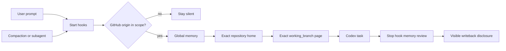

<div align="center">

# Codex Obsidian Memory

### Local-first, branch-aware long-term memory for Codex — organized in Obsidian.

Plain Markdown files become durable project context: Codex loads the right notes before every task and reviews what is worth remembering when the task ends.

[](https://github.com/Wang-Ruibin/codex-obsidian-memory/actions/workflows/ci.yml)
[](LICENSE)
[](https://www.python.org/)

**English** · [简体中文](README.zh-CN.md) · [Documentation](#documentation) · [Security](SECURITY.md)

</div>

## What it can do for you

Codex Obsidian Memory turns a plain Markdown vault into durable project context. Lifecycle hooks load your global preferences, the exact project home, and the page for the branch you are on before work begins — and load them again after compaction and for subagents. When the task ends, Codex reviews whether anything durable emerged and writes it back for your review.

- Memory stays in Markdown files you own. No vector database, no cloud memory service, no credentials in the vault.
- Only the GitHub repositories you choose are eligible; ordinary folders stay silent.
- Branch pages are created when durable branch-specific progress exists, so parallel lines of work can stay separate without filling the vault with empty placeholders.
- Only durable facts are kept — decisions, outcomes, reusable failures and next steps — never chat transcripts.
- Whenever memory changes during a task, Codex is required to show a **Knowledge-base writeback review** with every changed file and a plain-language summary, so you can correct it before relying on the new memory.
- Setup is reversible: disable or uninstall the integration without deleting the vault.
- The runtime uses only the Python standard library.

> [!IMPORTANT]
> This is an early public release. Back up an existing vault and review every command in `/hooks` before trusting it.

## From installation to first memory

The entire setup can be completed by talking to Codex. You do not need to learn commands or edit configuration files by hand. You need:

- Codex CLI or Codex in the ChatGPT desktop app. On the same machine, the VS Code extension shares your local Codex settings and can use the plugin after you install and trust it through Codex CLI or the desktop app. The extension itself does not provide a plugin browser.
- Python 3.11+ (`python3` on macOS/Linux, `py.exe` on Windows).
- Git repositories whose `origin` points to GitHub.
- Obsidian is recommended for graph browsing; the runtime uses ordinary Markdown.

### 1. Ask Codex to install the plugin

Send this to Codex:

```text
Install the Codex Obsidian Memory plugin from
https://github.com/Wang-Ruibin/codex-obsidian-memory using the Codex plugin
marketplace commands. Check the environment, finish the installation, and verify
that the plugin is installed. Do not change any unrelated configuration. Tell me
whether I must start a new session when done.
```

Codex runs the equivalent of:

```bash
codex plugin marketplace add Wang-Ruibin/codex-obsidian-memory
codex plugin add codex-obsidian-memory@codex-obsidian-memory
```

Prefer the terminal? Typing these two commands yourself works just as well. Either way, start a new Codex conversation afterwards.

### 2. Ask Codex to create your vault

The vault is a plain folder of Markdown notes — your long-term memory. Pick any location you like: Codex creates the folder if it is missing, and you can open it in Obsidian at any time to browse the graph.

Start a new conversation, then say:

```text
Use $codex-obsidian-memory to initialize an English vault at /absolute/path/to/memory
for GitHub owner my-account. Ask me before changing any global Codex configuration.
```

Before sending, replace the two placeholders:

- `/absolute/path/to/memory` — where the vault lives, for example `D:\notes\agent-memory` on Windows or `~/obsidian/agent-memory` on macOS/Linux. Template files are only added; existing notes are never overwritten.
- `my-account` — your GitHub username or organization. Only repositories whose `origin` belongs to a configured owner load memory automatically. Name several owners if you need to, and include or exclude individual repositories later.

The example creates an English vault. For a Simplified Chinese vault, ask for "a Simplified Chinese vault" instead — it uses the `--locale zh-CN` template.

### 3. Trust the hooks and verify

1. Open `/hooks`, review the four plugin commands, and trust them.
2. Start a new conversation inside one of your GitHub repositories.
3. Ask Codex:

```text
Use $codex-obsidian-memory to run status and validate, then explain the results.
```

Healthy validation means zero missing required notes, duplicate project homes, duplicate branch identities, broken Wiki links and orphan nodes.

### 4. Work as usual

From now on, just work. When a task starts in an in-scope repository, Codex receives your global preferences, the project background and any matching branch page that already exists. When the task ends, it reviews what is worth keeping. If memory changed, the final reply must include a visible **Knowledge-base writeback review** listing every changed file and what was added, changed or removed. Read that short review and reply with corrections whenever something looks wrong.

## Optional routines

Weekly briefs and monthly audits are disabled by default. To enable them, ask Codex:

```text
Use $codex-obsidian-memory to set up the weekly brief and monthly audit on this
machine. Ask me before creating any scheduled task.
```

Successful ISO weeks and months are deduplicated; failures never advance state. A successful Codex exit counts only when the target report changed and the vault still passes graph validation. Monthly audits may recommend archival but never delete, move or archive notes automatically.

Prefer to run the installer yourself? The following source-tree commands must be run from the root of a clone of this repository. For a marketplace-installed copy whose location is managed by Codex, ask Codex to locate and run the bundled installer.

Windows:

```powershell
powershell -ExecutionPolicy Bypass -File plugins/codex-obsidian-memory/scripts/install-windows-tasks.ps1
```

Windows tasks launch through a windowless `wscript.exe` wrapper.

Linux with systemd user services:

```bash
bash plugins/codex-obsidian-memory/scripts/install-linux-systemd.sh
```

The installer requires no `sudo`. It creates persistent user timers at 09:00 and 09:15, pins the discovered `python3` and `codex` paths, and runs in the background with runner logs plus the systemd user journal. Remove only these units and their stable copy with `--uninstall`.

macOS or Linux without user systemd: schedule `routine_runner.py weekly` and `monthly` with launchd, cron, or another user-level scheduler. Use absolute executable paths and keep the same least-privilege, failure-retry and no-success-before-validation rules.

## Adopt an existing vault

Already have an Obsidian vault you like? Ask Codex:

```text
Use $codex-obsidian-memory to adopt my existing vault at /absolute/path/to/memory
without overwriting my layout. Map my folders explicitly and validate afterwards.
```

Codex uses `--no-template` plus repeatable `--path KEY=RELATIVE_PATH` mappings instead of overwriting an established layout. All paths must remain relative to the vault. See the [migration guide](plugins/codex-obsidian-memory/skills/codex-obsidian-memory/references/migration.md).

## What you receive

- A memory home with global preferences, a maintenance page and templates, in English or Simplified Chinese.
- One folder per GitHub repository: a single project home plus branch pages created as durable branch-specific context appears.
- Weekly-brief and monthly-audit pages, ready if you later enable the optional routines.
- A visible writeback review whenever Codex changes a note — nothing enters long-term memory silently.

## Manage memory by asking

You rarely need commands. Describe what you want:

| What you want | What to say |
|---|---|
| Check configuration and vault health | "Use $codex-obsidian-memory to run status and validate." |
| Pause automatic memory | "Use $codex-obsidian-memory to disable memory until I ask again." |
| Resume automatic memory | "Use $codex-obsidian-memory to enable memory again." |
| Keep one repository silent | "Use $codex-obsidian-memory to exclude OWNER/REPO." |
| Load a repository outside your owner scope | "Use $codex-obsidian-memory to include OWNER/REPO." |
| Remove the integration | "Use $codex-obsidian-memory to uninstall, but keep my vault." |

Behind each request Codex runs the matching plugin command — `status`, `enable`, `disable`, `include`, `exclude`, `validate` or `uninstall` — and shows you the result.

`uninstall` never deletes or moves the vault. It stops the integration and removes the access entry added during setup. Diagnostic logs and routine history are kept by default; if you want those removed too, ask Codex to review and delete only this plugin's remaining local state while keeping the vault. Afterwards, ask Codex to remove the plugin package, or run:

```bash
codex plugin remove codex-obsidian-memory@codex-obsidian-memory
```

## How it works



```text
Memory home ── global memory / maintenance / template
     │
     └── Project index ── repository home ── exact branch pages
```

See the [structure reference](plugins/codex-obsidian-memory/skills/codex-obsidian-memory/references/structure.md).

Hooks decide what to load from exact repository identity, never from note content:

| Workspace | Default behavior |
|---|---|
| Configured owner, indexed repository | Load global memory, project home and a linked page matching the current branch, when present |
| Configured owner, new repository | Load global memory, index and template; register only for durable context |
| Explicitly included `OWNER/REPO` | Load outside automatic owner scope |
| Explicitly excluded `OWNER/REPO` | Stay silent |
| Local-only repo, another Git host or ordinary folder | Stay silent |
| The vault itself | Load maintenance context |

Repository identity is read with non-mutating Git commands. SSH credentials, private keys, tokens and Git configuration secrets are never read into memory.

## Security

- Memory stays local: no telemetry, no remote memory service, no credential collection.
- Every note is resolved inside the configured vault, and common secret patterns are redacted before injection.
- Hooks stay silent in ordinary folders, on other Git hosts and in excluded repositories.
- Version 0.4.0 cannot safely distinguish branch names that differ only by uppercase and lowercase letters, such as `Release` and `release`. Avoid that naming pattern for now.
- No command deletes or moves your vault. Uninstall stops the integration and removes the access entry added during setup; diagnostic history is kept unless you ask Codex to remove it too.
- Scheduled audits may recommend archival, but never delete, move or archive notes on their own.

Read [SECURITY.md](SECURITY.md) for the full policy.

## Troubleshooting

| Situation | What to do |
|---|---|
| Hook is silent | Ask Codex to run `status`, verify the GitHub `origin`, and check exclusions. |
| Hook is installed but skipped | Trust it in `/hooks`, then start a new conversation. |
| Wrong branch context | Check `git branch --show-current` and the exact `working_branch` frontmatter. |
| Branches differ only by letter case | Rename one branch or keep only one matching page; version 0.4.0 treats those names as the same branch. |
| Detached HEAD | No exact branch page can be selected until a branch is checked out. |
| Some memory seems missing | Keep project homes and linked notes concise, or ask Codex to open the specific note directly. Very large memory pages may be shortened when loaded. |
| Secret redaction | Treat it as defense in depth, not a complete secret scanner. |
| Scheduled reports | The machine needs a working non-interactive Codex login. |
| A write occurred but no disclosure appeared | Do not accept the result; verify the hook is trusted and start a new conversation. |

## Documentation

- [Migration guide](plugins/codex-obsidian-memory/skills/codex-obsidian-memory/references/migration.md)
- [Automation guide](plugins/codex-obsidian-memory/skills/codex-obsidian-memory/references/automation.md)
- [Security policy](SECURITY.md)
- [Build case study](docs/case-study.md)
- [Contributing guide](CONTRIBUTING.md)

## License

[MIT](LICENSE). Copyright © 2026 Wang-Ruibin.

If it gave Codex a better memory, a little ⭐ would make this vault very happy. ✨
