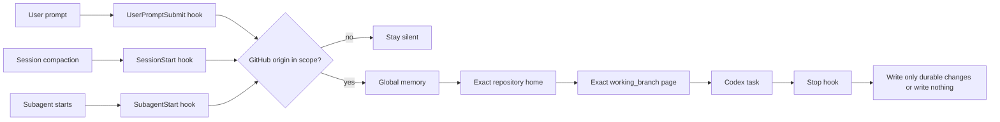

<div align="center">

# Codex Obsidian Memory

**Local-first, branch-aware long-term memory for Codex — organized in Obsidian.**

[](https://github.com/Wang-Ruibin/codex-obsidian-memory/actions/workflows/ci.yml)
[](LICENSE)
[](https://www.python.org/)

[中文](README.zh-CN.md) · [How it was built](docs/case-study.md) · [Security](SECURITY.md)

</div>

Codex Obsidian Memory turns a plain Markdown vault into durable project context. Lifecycle hooks load the right notes before work, reload them after compaction and for subagents, then require a concise memory review before a task ends.

No vector database. No cloud memory service. No credentials in the vault.

> [!IMPORTANT]
> This project is an early public release. Back up an existing vault before adoption and review every hook in `/hooks` before trusting it.

## Why this exists

Agent memory often fails in one of two ways: it is too passive to load reliably, or too broad to keep projects and branches separated. This plugin uses deterministic lifecycle hooks plus a small, inspectable graph model:

- **Local-first** — memory remains in Markdown files you own.
- **Repository-scoped** — GitHub `origin` determines eligibility; ordinary folders stay silent.
- **Branch-aware** — only the page whose `working_branch` exactly matches the checkout is loaded.
- **Graph-friendly** — one repository, one folder, one project home; branch pages live beneath it.
- **Selective** — retain decisions, outcomes, reusable failures and next steps, not chat transcripts.
- **Reversible** — disable or uninstall the integration without deleting the vault.
- **Dependency-light** — Python standard library only.

## Quick start

### Requirements

- Codex CLI or Codex in the ChatGPT desktop app. Plugin installation is not currently available in the IDE extension.
- Python 3.11 or newer (`python3` on macOS/Linux, `py.exe` on Windows).
- Git repositories with a GitHub `origin`.
- Obsidian is recommended for browsing the graph, but the runtime uses ordinary Markdown.

### 1. Install the plugin

```bash
codex plugin marketplace add Wang-Ruibin/codex-obsidian-memory
codex plugin add codex-obsidian-memory@codex-obsidian-memory
```

Start a new Codex conversation after installation.

### 2. Create or adopt a vault

Ask Codex:

```text
Use $codex-obsidian-memory to initialize a vault at /absolute/path/to/my-memory
for GitHub owner my-account.
```

The setup is additive by default: existing files are skipped. It creates the vault template, stores local integration configuration, and can add the vault as a narrow writable root when Codex uses `workspace-write` sandboxing.

### 3. Trust and verify

1. Open `/hooks` and review the four plugin commands.
2. Trust the hook definition.
3. Start a new conversation inside an eligible GitHub repository.
4. Run `$codex-obsidian-memory status`, then `$codex-obsidian-memory validate`.

Healthy validation means zero missing required notes, duplicate project homes, duplicate branch identities, broken Wiki links and orphan nodes.

## How it works



The default graph has two clusters and one intentional bridge:

```text
Memory home ── global memory / maintenance / template
     │
     └── Project index ── repository home ── exact branch pages
```

See [the structure reference](plugins/codex-obsidian-memory/skills/codex-obsidian-memory/references/structure.md) for note identity rules.

## Repository scope

| Workspace | Default behavior |
|---|---|
| Configured GitHub owner, indexed repository | Load global memory, project home and exact branch page |
| Configured GitHub owner, new repository | Load global memory, index and template; register only when durable context exists |
| Explicitly included `OWNER/REPO` | Load even outside automatic owner scope |
| Explicitly excluded `OWNER/REPO` | Stay silent |
| Local-only repository, other Git host or ordinary folder | Stay silent |
| The vault itself | Load maintenance context |

Repository identity is read with non-mutating Git commands. SSH credentials, private keys, tokens and Git configuration secrets are never read into memory.

## Commands

Use the skill in Codex, or run `scripts/memoryctl.py` from the installed plugin root.

```text
status                         Show configuration and vault health
enable / disable               Toggle automatic behavior without deleting data
include OWNER/REPO             Add an explicit repository inclusion
exclude OWNER/REPO             Add an explicit repository exclusion
validate                       Check schema, identities and graph links
uninstall                      Remove plugin state and its own writable-root entry
```

`uninstall` never deletes or moves the vault. Remove the plugin itself afterwards with:

```bash
codex plugin remove codex-obsidian-memory@codex-obsidian-memory
```

## Adopt an existing vault

Do not force the English template over an established layout. Map its existing relative paths instead:

```powershell
py.exe plugins/codex-obsidian-memory/scripts/memoryctl.py init `
  --vault D:\path\to\vault `
  --github-owner my-account `
  --no-template `
  --path home=00-home.md `
  --path global_memory=10-memory/global.md `
  --path maintenance=10-memory/maintenance.md `
  --path template=10-memory/template.md `
  --path project_index=20-projects/index.md `
  --path projects_dir=20-projects
```

All mapped paths must be relative and remain inside the vault. Run `validate` before enabling normal work. The full migration checklist is in [migration.md](plugins/codex-obsidian-memory/skills/codex-obsidian-memory/references/migration.md).

## Optional weekly and monthly routines

Recurring reports are off by default. On Windows, review the installer and then run:

```powershell
powershell -ExecutionPolicy Bypass -File plugins/codex-obsidian-memory/scripts/install-windows-tasks.ps1
```

It installs two current-user tasks: a daily 09:00 weekly-brief check and a daily 09:15 monthly-audit check. Successful ISO weeks/months are deduplicated; failures do not advance state. Remove only those tasks with `-Uninstall`.

macOS and Linux users can schedule `plugins/codex-obsidian-memory/scripts/routine_runner.py weekly` and `monthly` with launchd, systemd timers or cron. The monthly workflow may mark archive recommendations, but it never deletes, moves or archives notes automatically.

## Troubleshooting

- **The hook is silent:** run `status`, confirm the repository has a GitHub `origin` in scope, then inspect explicit exclusions.
- **The hook appears installed but does not run:** review and trust it in `/hooks`, then start a new conversation.
- **The wrong branch context appears:** confirm `git branch --show-current` is not detached and check the page's exact `working_branch` frontmatter.
- **Validation reports a broken link:** use a vault-root Wiki path or an unambiguous local Wiki link; fenced example blocks are ignored.
- **An existing vault gained unwanted default pages:** restore from backup, remove only the newly added default files, then adopt it with `--no-template` and explicit path mappings.

## Limitations

- The plugin identifies repository ownership from GitHub origin metadata; it cannot determine whether a newly uploaded repository is semantically “code” without an explicit exclusion.
- Detached HEAD checkouts have no exact branch page.
- Secret redaction is defense in depth, not a complete secret scanner.
- Scheduled reports require a working non-interactive Codex login on that machine.

## Security model

- Hook scripts receive the configured vault path and read only resolved files inside that vault.
- Common token and private-key patterns are redacted again before context injection.
- Plugin hooks remain inactive until reviewed and trusted.
- Setup backs up `config.toml` before a narrow writable-root edit.
- Uninstall removes that root only if this plugin added it.
- The vault is always user-owned and is never removed by plugin commands.

Read [SECURITY.md](SECURITY.md) before using the plugin with sensitive repositories.

## Provenance

This project packages a three-day, end-to-end build of a real Obsidian memory vault. The original system finished with 25 repository homes, 26 exact branch pages, four lifecycle handlers, zero broken links, zero orphan nodes and one intentional cross-cluster edge. The design history, failed approaches and reusable lessons are documented in [the case study](docs/case-study.md).

The README organization follows patterns common to established memory and Obsidian projects such as [Mem0](https://github.com/mem0ai/mem0), [Graphiti](https://github.com/getzep/graphiti) and [Obsidian Git](https://github.com/Vinzent03/obsidian-git): value first, a short quick start, explicit boundaries, architecture, troubleshooting and contribution paths.

## Development

```bash
python -m unittest discover -s tests -v
python plugins/codex-obsidian-memory/scripts/memoryctl.py --help
```

Before submitting a change, validate the plugin manifest and bundled skill with the current Codex plugin and skill validators. See [CONTRIBUTING.md](CONTRIBUTING.md).

## License

[MIT](LICENSE)
