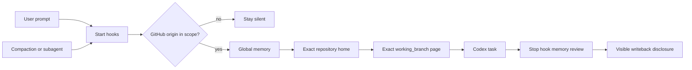

<div align="center">

# Codex Obsidian Memory

### Start a new Codex conversation and keep your project moving.

Keep project background, confirmed decisions and next steps in local notes for Codex to refer to next time. Ask for work as usual, and use Obsidian to view or edit those memories.

[](https://github.com/Wang-Ruibin/codex-obsidian-memory/actions/workflows/ci.yml)
[](LICENSE)
[](https://www.python.org/)

**English** · [简体中文](README.zh-CN.md) · [Get started](#from-installation-to-first-memory) · [Documentation](#documentation) · [Security](SECURITY.md)

</div>

## What it can do for you

Codex Obsidian Memory turns a plain Markdown vault into durable project context. Lifecycle hooks load your global preferences, the exact project home, and the page for the branch you are on before work begins — and load them again after compaction and for subagents. When the task ends, Codex reviews whether anything durable emerged and writes it back for your review.

- Memory stays in Markdown files you own. No vector database, no cloud memory service, no credentials in the vault.
- Only the GitHub repositories you choose are eligible; ordinary folders stay silent.
- Branch pages are created when durable branch-specific progress exists, so parallel lines of work can stay separate without filling the vault with empty placeholders.
- Only durable facts are kept — decisions, outcomes, reusable failures and next steps — never chat transcripts.
- Whenever memory changes during a task, Codex is required to show a **Knowledge-base writeback review** with every changed file and a plain-language summary, so you can correct it before relying on the new memory.
- Setup is reversible: disable or uninstall the integration without deleting the vault.
- The runtime uses only the Python standard library.

> [!IMPORTANT]
> This is an early public release. Back up an existing vault and review every command in `/hooks` before trusting it.

## From installation to first memory

This plugin adds memory to Codex, so you still work in Codex. Obsidian lets you view the notes; there is no chat button to find there. It is intended for GitHub code projects: ordinary folders and local-only projects do not load memory automatically, and it does not save your entire chat history.

You need:

- Codex CLI or Codex in the ChatGPT desktop app. On the same machine, the VS Code extension shares your local Codex settings and can use the plugin after you install and trust it through Codex CLI or the desktop app. The extension itself does not provide a plugin browser.
- Python 3.11+ (`python3` on macOS/Linux, `py.exe` on Windows).
- A project folder on your computer linked to GitHub (technically, a Git repository whose `origin` points to GitHub). A GitHub account, web address or downloaded ZIP alone is not enough; ask Codex to check if you are unsure.
- Obsidian is recommended for graph browsing; the runtime uses ordinary Markdown.

Copy text labeled “send to Codex” into **Codex's chat input**, just like a message, rather than into an Obsidian note or PowerShell. Wait for Codex to finish and confirm each step before continuing; installation and initialization usually happen once. If a message is unclear, ask it to explain “What do I need to do now?”

### 1. Ask Codex to install the plugin

Send this to Codex:

```text
Install the Codex Obsidian Memory plugin from
https://github.com/Wang-Ruibin/codex-obsidian-memory using the Codex plugin
marketplace commands. Check the environment, finish the installation, and verify
that the plugin is installed. Do not change any unrelated configuration. Tell me
whether I must start a new session when done.
```

Codex runs the equivalent of:

```bash
codex plugin marketplace add Wang-Ruibin/codex-obsidian-memory
codex plugin add codex-obsidian-memory@codex-obsidian-memory
```

Prefer the terminal? Typing these two commands yourself works just as well. Either way, start a new Codex conversation afterwards.

You are done when Codex confirms installation and a new conversation recognizes `$codex-obsidian-memory`. If Python is missing or the installation command is not recognized, give Codex the full message and ask it to check the environment before moving on.

### 2. Ask Codex to create your vault

The vault is a plain folder of Markdown notes — your long-term memory. Pick any location you like: Codex creates the folder if it is missing, and you can open it in Obsidian at any time to browse the graph.

Start a new conversation and send this to Codex; you do not need to fill in a path or username yourself:

```text
Use $codex-obsidian-memory to help me create an English memory vault.
Check for an existing setup first to avoid initializing it twice. Help me confirm
the GitHub username or organization for this project, then ask where to store notes.
If I am unsure, explain and suggest a suitable location on this computer.
Create it after confirmation without overwriting notes. Ask me before changing any
global Codex configuration. Tell me the full vault path and which projects will use memory.
```

Codex will help you confirm two things:

- Where notes live: for example, `D:\notes\agent-memory` on Windows or `~/obsidian/agent-memory` on macOS/Linux, with Codex confirming the full path. This folder holds memory notes; open your own project folder for everyday work.
- Your GitHub username or organization: for a project at `https://github.com/my-account/my-project`, the name is `my-account`. You can name multiple accounts and include or exclude individual repositories.

The example creates an English vault. For a Simplified Chinese vault, ask for "a Simplified Chinese vault" instead — it uses the `--locale zh-CN` template.

You are done when Codex gives you the full notes path, confirms memory is enabled and explains which projects are in scope. Keep that path; you can use Obsidian's “Open folder as vault” to view it later.

### 3. Trust the hooks and verify

Hooks are actions that run automatically when you start and finish tasks. After installation, you must trust them before automatic memory loading and checks can run.

1. Enter `/hooks` in **Codex CLI's input**, then review and trust this plugin's four commands. This is not a PowerShell command. If your interface has no such entry, tell Codex which client you use and ask it to guide you through the local CLI. See the [official OpenAI hook guide](https://learn.chatgpt.com/docs/hooks).
2. Open **the project folder you want to work on** in Codex and start a new conversation; with the CLI, launch Codex from that project directory. Do not just open the plugin source or the memory notes folder.
3. Send this to Codex:

```text
Use $codex-obsidian-memory to run status and validate, and check whether this project
is in memory scope. In plain language, tell me whether memory is enabled, where notes
are stored, whether this project can use it and what steps remain. Do not just show
raw check results. If the project is out of scope, explain why before changing any
repository settings or uploading files.
```

You are done when memory is enabled, the vault passes validation and this project is in scope. **Passing vault validation alone does not prove that this project will load memory automatically.** Ask Codex to explain if the folder is not a Git repository, is not linked to GitHub or is excluded.

### 4. Save a memory, then start a new conversation

In the project verified in step 3, send this to Codex (change the preference to something you actually want):

```text
Remember this collaboration preference for this project: give me one step at a time,
and explain where to do it and what success looks like. Save it in this project's
long-term memory and tell me which note file you updated.
```

When the task finishes, look for the **Knowledge-base writeback review** in the reply. It should list the changed note files and what was saved. Ask Codex to open that note if needed; saying “I remembered it” alone does not prove anything was saved.

Then start a new conversation in **the same project and branch** (branches are different working versions of a project; if you have not switched, leave it as it is) and send:

```text
Based on the project memory already loaded, what is my preference for instructions?
Identify the source note. If it was not loaded, say so rather than guessing, and do
not manually search the vault yet.
```

If the new conversation accurately recalls the preference and identifies its source, you have completed your first “save → new conversation → read” exercise. If it does not, return to step 3 to troubleshoot.

After that, ask for work as usual in Codex, such as “Help me start this project” or “Continue the previous task; first tell me where we left off.” Everyday tasks do not need `$codex-obsidian-memory` or repeated installation. Codex reviews what is worth keeping at the end of a task; no new note is normal when there is no new durable information. To correct a mistake, say “Change that project memory to…” and check the updated writeback review.

## Optional routines

Weekly briefs and monthly audits are disabled by default. To enable them, ask Codex:

```text
Use $codex-obsidian-memory to set up the weekly brief and monthly audit on this
machine. Ask me before creating any scheduled task.
```

Weekly briefs summarize progress; monthly audits review the notes and suggest maintenance. Scheduled runs need this computer to be available and Codex signed in. Monthly audits may recommend archiving notes but never delete, move or archive them automatically.

For platform-specific setup and removal, see the [automation guide](plugins/codex-obsidian-memory/skills/codex-obsidian-memory/references/automation.md).

## Adopt an existing vault

Already have an Obsidian vault you like? Ask Codex:

```text
Use $codex-obsidian-memory to adopt my existing vault at /absolute/path/to/memory
without overwriting my layout. Map my folders explicitly and validate afterwards.
```

Codex uses `--no-template` plus repeatable `--path KEY=RELATIVE_PATH` mappings instead of overwriting an established layout. All paths must remain relative to the vault. See the [migration guide](plugins/codex-obsidian-memory/skills/codex-obsidian-memory/references/migration.md).

## What you receive

- A memory home with global preferences, a maintenance page and templates, in English or Simplified Chinese.
- One folder per GitHub repository: a single project home plus branch pages created as durable branch-specific context appears.
- Weekly-brief and monthly-audit pages, ready if you later enable the optional routines.
- A visible writeback review whenever Codex changes a note — nothing enters long-term memory silently.

## Manage memory by asking

You rarely need commands. Describe what you want:

| What you want | What to say |
|---|---|
| Check configuration and vault health | "Use $codex-obsidian-memory to run status and validate." |
| Pause automatic memory | "Use $codex-obsidian-memory to disable memory until I ask again." |
| Resume automatic memory | "Use $codex-obsidian-memory to enable memory again." |
| Keep one repository silent | "Use $codex-obsidian-memory to exclude OWNER/REPO." |
| Load a repository outside your owner scope | "Use $codex-obsidian-memory to include OWNER/REPO." |
| Remove the integration | "Use $codex-obsidian-memory to uninstall, but keep my vault." |

Behind each request Codex runs the matching plugin command — `status`, `enable`, `disable`, `include`, `exclude`, `validate` or `uninstall` — and shows you the result.

`uninstall` never deletes or moves the vault. It stops the integration and removes the access entry added during setup. Diagnostic logs and routine history are kept by default; if you want those removed too, ask Codex to review and delete only this plugin's remaining local state while keeping the vault. Afterwards, ask Codex to remove the plugin package, or run:

```bash
codex plugin remove codex-obsidian-memory@codex-obsidian-memory
```

## How it works



```text
Memory home ── global memory / maintenance / template
     │
     └── Project index ── repository home ── exact branch pages
```

See the [structure reference](plugins/codex-obsidian-memory/skills/codex-obsidian-memory/references/structure.md).

Hooks decide what to load from exact repository identity, never from note content:

| Workspace | Default behavior |
|---|---|
| Configured owner, indexed repository | Load global memory, project home and a linked page matching the current branch, when present |
| Configured owner, new repository | Load global memory, index and template; register only for durable context |
| Explicitly included `OWNER/REPO` | Load outside automatic owner scope |
| Explicitly excluded `OWNER/REPO` | Stay silent |
| Local-only repo, another Git host or ordinary folder | Stay silent |
| The vault itself | Load maintenance context |

Repository identity is read with non-mutating Git commands. SSH credentials, private keys, tokens and Git configuration secrets are never read into memory.

## Security

- Memory stays local: no telemetry, no remote memory service, no credential collection.
- Every note is resolved inside the configured vault, and common secret patterns are redacted before injection.
- Hooks stay silent in ordinary folders, on other Git hosts and in excluded repositories.
- Version 0.4.0 cannot safely distinguish branch names that differ only by uppercase and lowercase letters, such as `Release` and `release`. Avoid that naming pattern for now.
- No command deletes or moves your vault. Uninstall stops the integration and removes the access entry added during setup; diagnostic history is kept unless you ask Codex to remove it too.
- Scheduled audits may recommend archival, but never delete, move or archive notes on their own.

Read [SECURITY.md](SECURITY.md) for the full policy.

## Troubleshooting

| Situation | What to do |
|---|---|
| Hook is silent | Ask Codex to run `status`, verify the GitHub `origin`, and check exclusions. |
| Hook is installed but skipped | Trust it in `/hooks`, then start a new conversation. |
| Wrong branch context | Check `git branch --show-current` and the exact `working_branch` frontmatter. |
| Branches differ only by letter case | Rename one branch or keep only one matching page; version 0.4.0 treats those names as the same branch. |
| Detached HEAD | No exact branch page can be selected until a branch is checked out. |
| Some memory seems missing | Keep project homes and linked notes concise, or ask Codex to open the specific note directly. Very large memory pages may be shortened when loaded. |
| Secret redaction | Treat it as defense in depth, not a complete secret scanner. |
| Scheduled reports | The machine needs a working non-interactive Codex login. |
| A write occurred but no disclosure appeared | Do not accept the result; verify the hook is trusted and start a new conversation. |

## Documentation

- [Migration guide](plugins/codex-obsidian-memory/skills/codex-obsidian-memory/references/migration.md)
- [Automation guide](plugins/codex-obsidian-memory/skills/codex-obsidian-memory/references/automation.md)
- [Security policy](SECURITY.md)
- [Build case study](docs/case-study.md)
- [Contributing guide](CONTRIBUTING.md)

## License

[MIT](LICENSE). Copyright © 2026 Wang-Ruibin.

If it gave Codex a better memory, a little ⭐ would make this vault very happy. ✨
