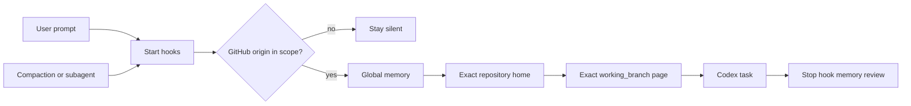

<div align="center">

# Codex Obsidian Memory

**Local-first, branch-aware long-term memory for Codex — organized in Obsidian.**

[](https://github.com/Wang-Ruibin/codex-obsidian-memory/actions/workflows/ci.yml)
[](LICENSE)
[](https://www.python.org/)

English · [简体中文](README.zh-CN.md) · [Documentation](#documentation) · [Security](SECURITY.md)

</div>

Codex Obsidian Memory turns a plain Markdown vault into durable project context. Lifecycle hooks load the right notes before work, reload them after compaction and for subagents, then require a concise memory review before a task ends.

No vector database. No cloud memory service. No credentials in the vault.

> [!IMPORTANT]
> This is an early public release. Back up an existing vault and review every command in `/hooks` before trusting it.

## Core capabilities

| Capability | What it means for users |
|---|---|
| Local-first | Memory stays in Markdown files you own. |
| Repository scope | Exact GitHub `origin` decides eligibility; ordinary folders stay silent. |
| Branch isolation | Only the page whose `working_branch` matches the checkout is loaded. |
| Clear graph | One repository has one folder and one project home, with branch pages beneath it. |
| Selective retention | Decisions, outcomes, reusable failures and next steps are kept; transcripts are not. |
| Reversible setup | Disable or uninstall the integration without deleting the vault. |
| Lightweight runtime | Runtime code uses only the Python standard library. |

## Quick start

### Requirements

- Codex CLI or Codex in the ChatGPT desktop app. Plugin installation is not currently available in the IDE extension.
- Python 3.11+ (`python3` on macOS/Linux, `py.exe` on Windows).
- Git repositories with a GitHub `origin`.
- Obsidian is recommended for graph browsing; the runtime uses ordinary Markdown.

### 1. Install

```bash
codex plugin marketplace add Wang-Ruibin/codex-obsidian-memory
codex plugin add codex-obsidian-memory@codex-obsidian-memory
```

Start a new Codex conversation after installation.

### 2. Create a vault

Ask Codex:

```text
Use $codex-obsidian-memory to initialize an English vault at /absolute/path/to/memory
for GitHub owner my-account.
```

For a Simplified Chinese vault, ask for `--locale zh-CN`. English is the default.

### 3. Trust and verify

1. Open `/hooks`, review the four plugin commands, and trust them.
2. Start a new conversation inside an eligible GitHub repository.
3. Run `$codex-obsidian-memory status`, then `$codex-obsidian-memory validate`.

Healthy validation means zero missing required notes, duplicate project homes, duplicate branch identities, broken Wiki links and orphan nodes.

## How it works



```text
Memory home ── global memory / maintenance / template
     │
     └── Project index ── repository home ── exact branch pages
```

See the [structure reference](plugins/codex-obsidian-memory/skills/codex-obsidian-memory/references/structure.md).

## Repository scope

| Workspace | Default behavior |
|---|---|
| Configured owner, indexed repository | Load global memory, project home and exact branch page |
| Configured owner, new repository | Load global memory, index and template; register only for durable context |
| Explicitly included `OWNER/REPO` | Load outside automatic owner scope |
| Explicitly excluded `OWNER/REPO` | Stay silent |
| Local-only repo, another Git host or ordinary folder | Stay silent |
| The vault itself | Load maintenance context |

Repository identity is read with non-mutating Git commands. SSH credentials, private keys, tokens and Git configuration secrets are never read into memory.

## Commands

```text
status                         Show configuration and vault health
enable / disable               Toggle automatic behavior without deleting data
include OWNER/REPO             Add an explicit repository inclusion
exclude OWNER/REPO             Add an explicit repository exclusion
validate                       Check schema, identities and graph links
uninstall                      Remove plugin state and its own writable-root entry
```

`uninstall` never deletes or moves the vault. Remove the plugin package afterwards:

```bash
codex plugin remove codex-obsidian-memory@codex-obsidian-memory
```

## Adopt an existing vault

Use `--no-template` plus repeatable `--path KEY=RELATIVE_PATH` mappings instead of overwriting an established layout. All paths must remain relative to the vault. See [migration.md](plugins/codex-obsidian-memory/skills/codex-obsidian-memory/references/migration.md).

## Optional routines

Weekly briefs and monthly audits are disabled by default.

### Windows

```powershell
powershell -ExecutionPolicy Bypass -File plugins/codex-obsidian-memory/scripts/install-windows-tasks.ps1
```

Windows tasks launch through a windowless `wscript.exe` wrapper. Successful ISO weeks/months are deduplicated; failures do not advance state. A successful Codex exit counts only when the target report changed and the vault still passes graph validation. Monthly audits may recommend archival but never delete, move or archive notes automatically.

### Linux with systemd user services

```bash
bash plugins/codex-obsidian-memory/scripts/install-linux-systemd.sh
```

The installer requires no `sudo`. It creates persistent user timers at 09:00 and 09:15, pins the discovered `python3` and `codex` paths, and runs in the background with runner logs plus the systemd user journal. Remove only these units and their stable copy with `--uninstall`.

### macOS or Linux without user systemd

Schedule `routine_runner.py weekly` and `monthly` with launchd, cron, or another user-level scheduler. Use absolute executable paths and keep the same least-privilege, failure-retry and no-success-before-validation rules.

## Troubleshooting and limitations

| Symptom or limitation | What to do |
|---|---|
| Hook is silent | Run `status`, verify the GitHub `origin`, and inspect exclusions. |
| Hook is installed but skipped | Trust it in `/hooks`, then start a new conversation. |
| Wrong branch context | Check `git branch --show-current` and exact `working_branch` frontmatter. |
| Detached HEAD | No exact branch page can be selected until a branch is checked out. |
| Secret redaction | Treat it as defense in depth, not a complete secret scanner. |
| Scheduled reports | The machine needs a working non-interactive Codex login. |

## Security

The plugin resolves every note inside the configured vault, redacts common secret patterns before injection, and removes a writable root only when setup recorded that it added it. Read [SECURITY.md](SECURITY.md).

## Documentation

- [Migration guide](plugins/codex-obsidian-memory/skills/codex-obsidian-memory/references/migration.md)
- [Automation guide](plugins/codex-obsidian-memory/skills/codex-obsidian-memory/references/automation.md)
- [Security policy](SECURITY.md)
- [Build case study](docs/case-study.md)
- [Contributing guide](CONTRIBUTING.md)

## License

[MIT](LICENSE). Copyright © 2026 Wang-Ruibin.

## Like this project?

If it gave Codex a better memory, a little ⭐ would make this vault very happy. ✨
