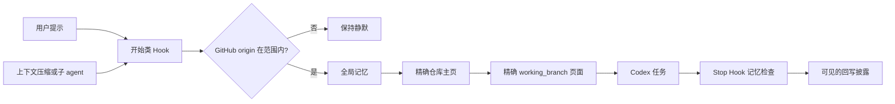

<div align="center">

# Codex Obsidian Memory

### 面向 Codex 的本地优先、分支感知长期记忆，由 Obsidian 组织。

普通 Markdown 文件变成持久项目上下文：Codex 在每个任务前加载正确的笔记，并在任务结束时审查哪些内容值得记住。

[](https://github.com/Wang-Ruibin/codex-obsidian-memory/actions/workflows/ci.yml)
[](LICENSE)
[](https://www.python.org/)

[English](README.md) · **简体中文** · [使用文档](#使用文档) · [安全策略](docs/zh-CN/SECURITY.md)

</div>

## 它能为你做什么

Codex Obsidian Memory 将普通 Markdown 知识库变成持久项目上下文。生命周期 Hook 会在开始工作前加载你的全局偏好、精确的项目主页和当前分支对应的页面，并在上下文压缩和子 agent 启动后重新加载。任务结束时，Codex 会审查是否产生了值得长期保留的内容，并把回写结果交给你确认。

- 记忆保存在你拥有的 Markdown 文件中。无需向量数据库，无需云端记忆服务，知识库中也不保存凭据。
- 只有你选择的 GitHub 仓库才会启用；普通目录保持静默。
- 每个工作分支都有独立页面，并行开展的线索互不混淆。
- 只保留持久事实——决策、结果、可复用失败经验和下一步——不保留对话流水账。
- 每次笔记变化都在最终回复中逐文件、逐事实披露，方便你纠正。
- 设置完全可逆：停用或卸载集成都不会删除知识库。
- 运行时代码只使用 Python 标准库。

> [!IMPORTANT]
> 当前是早期公开版本。迁移现有知识库前请先备份，并在信任前通过 `/hooks` 审阅每条命令。

## 开始之前

- Codex CLI 或 ChatGPT 桌面端中的 Codex。目前 IDE 扩展不支持插件安装。
- Python 3.11+；macOS/Linux 使用 `python3`，Windows 使用 `py.exe`。
- `origin` 指向 GitHub 的 Git 仓库。
- 推荐使用 Obsidian 浏览图谱；运行时只处理普通 Markdown。

## 从安装到第一段记忆

整个安装和配置都可以通过与 Codex 对话完成。你不需要学习命令，也不需要手工编辑配置文件。

### 1. 让 Codex 安装插件

把下面这段话发给 Codex：

```text
从 https://github.com/Wang-Ruibin/codex-obsidian-memory 安装 Codex Obsidian Memory
插件，使用 Codex 的 plugin marketplace 命令完成。检查环境，完成安装，并验证插件
已安装。不要改动任何无关配置。完成后告诉我是否需要新开一个会话。
```

Codex 会执行等效于：

```bash
codex plugin marketplace add Wang-Ruibin/codex-obsidian-memory
codex plugin add codex-obsidian-memory@codex-obsidian-memory
```

更喜欢自己动手？在终端输入这两条命令效果相同。无论哪种方式，之后都新开一个 Codex 会话。

### 2. 让 Codex 创建知识库

新开一个会话，然后说：

```text
使用 $codex-obsidian-memory，为 GitHub owner my-account 在 /absolute/path/to/memory
初始化一个简体中文知识库。修改任何全局 Codex 配置前，先征得我的同意。
```

把路径和 owner 换成你自己的值。示例使用简体中文（`--locale zh-CN`）；英文 `en` 是默认值。

### 3. 信任 Hook 并验证

1. 打开 `/hooks`，审阅并信任四条插件命令。
2. 在你的某个 GitHub 仓库中新开会话。
3. 让 Codex：

```text
使用 $codex-obsidian-memory 运行 status 和 validate，并解释结果。
```

健康状态要求：必需笔记无缺失、项目主页无重复、分支身份无重复、Wiki 链接无断链、无孤立节点。

### 4. 像平常一样工作

从现在开始，正常工作即可。在范围内的仓库开始任务时，Codex 已经掌握了你的全局偏好、项目背景和当前分支的进度。任务结束时，Codex 会检查是否产生了值得长期保留的内容；如果它回写了记忆，最终回复会以可见的 **知识库回写审查** 部分结尾，列出每个修改文件以及新增、修改或删除的事实。发现偏差时，直接回复纠正即可。

## 你会得到什么

- 一个记忆首页，包含全局偏好、维护页和模板，可选英文或简体中文。
- 每个 GitHub 仓库一个文件夹：一个项目主页，外加每个工作分支一个页面。
- 周报和月检页面已就位，以后启用可选周期任务即可使用。
- 每当 Codex 修改笔记，都会给出可见的回写审查——没有任何内容会悄悄进入长期记忆。

## 用对话管理记忆

你几乎不需要记命令。描述你想要什么即可：

| 你想要什么 | 可以这样说 |
|---|---|
| 查看配置与知识库健康状态 | “使用 $codex-obsidian-memory 运行 status 和 validate。” |
| 暂停自动记忆 | “使用 $codex-obsidian-memory 禁用记忆，直到我再次要求。” |
| 恢复自动记忆 | “使用 $codex-obsidian-memory 重新启用记忆。” |
| 让某个仓库保持静默 | “使用 $codex-obsidian-memory 排除 OWNER/REPO。” |
| 加载 owner 范围外的仓库 | “使用 $codex-obsidian-memory 包含 OWNER/REPO。” |
| 移除集成 | “使用 $codex-obsidian-memory 卸载，但保留我的知识库。” |

每个请求背后，Codex 会运行对应的插件命令——`status`、`enable`、`disable`、`include`、`exclude`、`validate` 或 `uninstall`——并向你展示结果。

`uninstall` 永远不会删除或移动知识库。之后可以让 Codex 移除插件包，或自行运行：

```bash
codex plugin remove codex-obsidian-memory@codex-obsidian-memory
```

## 工作原理



```text
记忆首页 ── 全局记忆 / 维护 / 模板
    │
    └── 项目总览 ── 仓库主页 ── 精确分支页
```

详见[结构参考](plugins/codex-obsidian-memory/skills/codex-obsidian-memory/references/zh-CN/structure.md)。

## 仓库范围

| 工作区 | 默认行为 |
|---|---|
| 已配置 owner 的已登记仓库 | 加载全局记忆、项目主页和精确分支页 |
| 已配置 owner 的新仓库 | 加载全局记忆、项目总览和模板；仅在产生持久上下文时登记 |
| 显式包含的 `OWNER/REPO` | 在自动 owner 范围外仍加载 |
| 显式排除的 `OWNER/REPO` | 保持静默 |
| 本地仓库、其他 Git 平台或普通目录 | 保持静默 |
| 知识库自身 | 加载维护上下文 |

仓库身份通过非修改性 Git 命令读取。SSH 凭据、私钥、令牌和 Git 配置秘密不会读入记忆。

## 接管现有知识库

已经有在用的 Obsidian 知识库？让 Codex：

```text
使用 $codex-obsidian-memory 接管我在 /absolute/path/to/memory 的现有知识库，
不要覆盖已有布局。显式映射我的文件夹，完成后运行验证。
```

Codex 会使用 `--no-template` 和可重复的 `--path KEY=RELATIVE_PATH` 映射，而不是覆盖已有布局。所有路径必须保持在知识库内部。详见[迁移指南](plugins/codex-obsidian-memory/skills/codex-obsidian-memory/references/zh-CN/migration.md)。

## 可选周期任务

周报和月检默认关闭。要启用它们，让 Codex：

```text
使用 $codex-obsidian-memory 在这台机器上设置每周周报和每月月检。创建任何计划
任务前，先征得我的同意。
```

成功的 ISO 周和月会去重；失败不会推进状态。只有目标报告确实更新且知识库仍通过图谱验证，Codex 的成功退出才记为周期成功。月检只能建议归档，不得自动删除、移动或归档笔记。

想自己运行安装器？

### Windows

```powershell
powershell -ExecutionPolicy Bypass -File plugins/codex-obsidian-memory/scripts/install-windows-tasks.ps1
```

Windows 任务通过无窗口 `wscript.exe` 包装器启动。

### 使用 systemd user service 的 Linux

```bash
bash plugins/codex-obsidian-memory/scripts/install-linux-systemd.sh
```

安装器不需要 `sudo`。它会创建每天 09:00 和 09:15 的持久用户 timer，固定安装时发现的 `python3` 与 `codex` 路径，并在后台运行；错误既写 runner 日志，也保留在 systemd user journal。使用 `--uninstall` 只删除这些 unit 和稳定副本。

### macOS 或没有 user systemd 的 Linux

使用 launchd、cron 或其他用户级调度器运行 `routine_runner.py weekly` 和 `monthly`。使用可执行文件绝对路径，并保持最小权限、失败重试和“验证前不记成功”的相同规则。

## 安全边界

- 记忆保持本地：无遥测、无远程记忆服务、不收集凭据。
- 任何笔记注入对话前，都会遮蔽常见秘密模式。
- Hook 在普通目录、其他 Git 平台和被排除仓库中保持静默。
- 只加载 `working_branch` 与当前 checkout 精确匹配的页面。
- 没有任何命令会删除或移动知识库；卸载只移除插件状态和它记录为自己添加的 writable root。
- 周期月检可以建议归档，但绝不会自行删除、移动或归档笔记。

## 故障排查

| 情况 | 处理方式 |
|---|---|
| Hook 没有加载记忆 | 让 Codex 运行 `status`，确认 GitHub `origin` 并检查排除项。 |
| Hook 已安装但被跳过 | 在 `/hooks` 中信任，然后新开会话。 |
| 加载了错误分支 | 检查 `git branch --show-current` 和精确的 `working_branch` frontmatter。 |
| Detached HEAD | 切换到具体分支后才能选择精确分支页。 |
| 秘密遮蔽 | 它只是纵深防御，不是完整的秘密扫描器。 |
| 周期报告 | 机器需要可用的非交互 Codex 登录。 |
| 已发生回写但没有披露 | 不要接受该结果；确认 Hook 已信任并新开会话。 |

## 安全

插件把所有笔记解析在配置的知识库内部，注入前遮蔽常见秘密模式，并且只移除 Setup 记录为自己添加的 writable root。请阅读[安全策略](docs/zh-CN/SECURITY.md)。

## 使用文档

- [迁移指南](plugins/codex-obsidian-memory/skills/codex-obsidian-memory/references/zh-CN/migration.md)
- [自动化指南](plugins/codex-obsidian-memory/skills/codex-obsidian-memory/references/zh-CN/automation.md)
- [安全策略](docs/zh-CN/SECURITY.md)
- [构建案例](docs/zh-CN/case-study.md)
- [贡献指南](docs/zh-CN/CONTRIBUTING.md)

## 许可证

[MIT](LICENSE)。版权所有 © 2026 Wang-Ruibin。

如果它让 Codex 记得更清楚，欢迎送它一颗小星星 ⭐，这个记忆库会很开心的！✨
