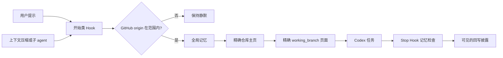

<div align="center">

# Codex Obsidian Memory

### 让 Codex 换个对话，也能接着你的项目继续做。

把项目背景、已确认的决定和下一步保存在本地笔记里，下次工作时交给 Codex 参考。你照常提需求，也可以用 Obsidian 查看和修改这些记忆。

[](https://github.com/Wang-Ruibin/codex-obsidian-memory/actions/workflows/ci.yml)
[](LICENSE)
[](https://www.python.org/)

[English](README.md) · **简体中文** · [开始使用](#从安装到第一段记忆) · [使用文档](#使用文档) · [安全策略](docs/zh-CN/SECURITY.md)

</div>

## 它能为你做什么

Codex Obsidian Memory 将普通 Markdown 知识库变成持久项目上下文。生命周期 Hook 会在开始工作前加载你的全局偏好、精确的项目主页和当前分支对应的页面，并在上下文压缩和子 agent 启动后重新加载。任务结束时，Codex 会审查是否产生了值得长期保留的内容，并把回写结果交给你确认。

- 记忆保存在你拥有的 Markdown 文件中。无需向量数据库，无需云端记忆服务，知识库中也不保存凭据。
- 只有你选择的 GitHub 仓库才会启用；普通目录保持静默。
- 只有产生持久分支进度时才创建独立分支页，既隔离并行线索，也避免用空占位页填满知识库。
- 只保留持久事实——决策、结果、可复用失败经验和下一步——不保留对话流水账。
- 只要任务中修改了记忆，Codex 就必须给出 **知识库回写审查**，逐文件说明改了什么，方便你在依赖新记忆前检查和纠正。
- 设置完全可逆：停用或卸载集成都不会删除知识库。
- 运行时代码只使用 Python 标准库。

> [!IMPORTANT]
> 当前是早期公开版本。迁移现有知识库前请先备份，并在信任前通过 `/hooks` 审阅每条命令。

## 从安装到第一段记忆

这是给 Codex 增加记忆的插件，使用入口仍是 Codex。Obsidian 用来查看笔记，无需在里面找聊天按钮。它面向 GitHub 代码项目：普通文件夹、只在本地的项目不会自动记忆，也不会保存你的全部聊天记录。

你需要：

- Codex CLI 或 ChatGPT 桌面端中的 Codex。同一台机器上的 VS Code 扩展共享本地 Codex 配置；先通过 Codex CLI 或桌面端安装并信任插件，之后即可在扩展中使用。扩展本身不提供插件浏览器。
- Python 3.11+；macOS/Linux 使用 `python3`，Windows 使用 `py.exe`。
- 电脑上有一个关联 GitHub 的项目文件夹（技术上是 `origin` 指向 GitHub 的 Git 仓库）。只有 GitHub 账号、网页地址或下载的 ZIP 文件还不够；不确定时让 Codex 检查。
- 推荐使用 Obsidian 浏览图谱；运行时只处理普通 Markdown。

下面标注“发给 Codex”的文字，复制到 **Codex 的聊天输入框**，像发消息一样发送即可，不要粘贴到 Obsidian 笔记或 PowerShell 中。每步等 Codex 完成并确认结果后再继续；安装和初始化通常只做一次。看不懂提示时，直接让它解释“我现在需要做什么”。

### 1. 让 Codex 安装插件

把下面这段话发给 Codex：

```text
从 https://github.com/Wang-Ruibin/codex-obsidian-memory 安装 Codex Obsidian Memory
插件，使用 Codex 的 plugin marketplace 命令完成。检查环境，完成安装，并验证插件
已安装。不要改动任何无关配置。完成后告诉我是否需要新开一个会话。
```

Codex 会执行等效于：

```bash
codex plugin marketplace add Wang-Ruibin/codex-obsidian-memory
codex plugin add codex-obsidian-memory@codex-obsidian-memory
```

更喜欢自己动手？在终端输入这两条命令效果相同。无论哪种方式，之后都新开一个 Codex 会话。

完成标志：Codex 确认插件已安装，新对话能识别 `$codex-obsidian-memory`。如果提示缺少 Python 或不认识安装命令，把完整提示发给 Codex，让它先检查环境，不要跳到下一步。

### 2. 让 Codex 创建知识库

知识库就是一个普通的 Markdown 笔记文件夹，也就是你的长期记忆。位置任选：文件夹不存在时 Codex 会自动创建，之后随时可以用 Obsidian 打开它来浏览图谱。

新开一个会话，把下面这段话发给 Codex；不用自己填写路径或用户名：

```text
使用 $codex-obsidian-memory，带我创建简体中文记忆知识库。
先检查是否已经配置过，避免重复初始化。请帮我确认当前项目对应的 GitHub 用户名
或组织名，再问我笔记存在哪里；我不清楚时，请解释并建议一个适合本机的位置。
确认后再创建，不要覆盖已有笔记。修改任何全局 Codex 配置前，先征得我的同意。
完成后告诉我知识库的完整路径，以及哪些项目会启用记忆。
```

Codex 会帮你确认两件事：

- 笔记存放位置：例如 Windows 上的 `D:\notes\agent-memory`，或 macOS/Linux 上的 `~/obsidian/agent-memory`，由 Codex 确认完整路径。这里存的是记忆笔记；日常工作仍打开你自己的项目文件夹。
- GitHub 用户名或组织名：例如项目地址为 `https://github.com/my-account/my-project`，对应的名字就是 `my-account`。有多个账号可以一并说明；单个仓库也可以单独包含或排除。

示例初始化的是简体中文知识库（`--locale zh-CN` 模板）；想要英文知识库就把“简体中文”说成“英文”，英文 `en` 是默认值。

完成标志：Codex 告诉你笔记存放的完整路径、记忆已启用和适用的项目范围。记下这个路径，之后可用 Obsidian 的“打开文件夹作为仓库”打开它。

### 3. 信任 Hook 并验证

Hook 是在你开始和结束任务时自动运行的操作。安装插件后还需要信任它们，才能自动加载和检查记忆。

1. 在 **Codex CLI 的输入框**输入 `/hooks`，审阅并信任本插件的四条命令。这不是 PowerShell 命令。如果当前界面没有这个入口，告诉 Codex 你用的客户端，请它引导你在本机 CLI 中完成。参见 [OpenAI 官方 Hook 说明](https://learn.chatgpt.com/docs/hooks)。
2. 在 Codex 中打开**你要做的项目文件夹**，新建一个对话；使用 CLI 时，从该项目目录启动 Codex。不要只打开插件源码或记忆笔记文件夹。
3. 把下面这段话发给 Codex：

```text
使用 $codex-obsidian-memory 运行 status 和 validate，并检查当前项目是否在记忆范围内。
请用普通话告诉我：记忆是否启用、笔记存在哪里、当前项目能否使用、还缺哪一步。
不要只给我原始检查数据；如果不在范围内，请解释原因，先不要修改仓库或上传文件。
```

完成标志：记忆已启用，知识库检查通过，当前项目也在适用范围内。**只看到检查通过，还不能证明当前项目会自动加载记忆。** 普通文件夹、未关联 GitHub 的项目或被排除的仓库，需要先由 Codex 说明原因。

### 4. 试一次保存记忆，再开新对话

在第三步确认可用的项目里，把下面这段话发给 Codex（偏好可改成你真实需要的）：

```text
请记住本项目的协作偏好：给我操作步骤时，一次只讲一步，并说明在哪里操作、
看到什么算成功。请保存到这个项目的长期记忆里，并告诉我写到了哪个笔记文件。
```

等任务结束，查看回复里的 **知识库回写审查**：应列出修改的笔记文件和保存的内容。需要时让 Codex 打开那份笔记核对；只有口头说“记住了”，还不能证明已经保存。

然后在**同一个项目、同一个分支**新开对话（分支就是同一项目的不同工作版本；没有切换过就保持原样），发送：

```text
请根据已加载的项目记忆，说出我对操作步骤有什么偏好，并指出来源笔记。
如果没有加载到，请明确告诉我，不要猜测，也先不要手动搜索知识库。
```

新对话能准确说出刚才的偏好并指出来源，才完成了“保存 → 换对话 → 读取”的第一次使用。如果没读到，回到第三步排查。

以后照常在 Codex 里提需求，例如“帮我看看这个项目怎么启动”或“继续上次的任务，先告诉我做到哪了”。日常任务不用每次输入 `$codex-obsidian-memory`，也不用重复安装。Codex 会在任务结束时审查值得保留的内容；没有新增长期信息时，不新增笔记是正常的。记错了就直接说“请把刚才那条项目记忆改成……”，再查看修改后的回写审查。

## 可选周期任务

周报和月检默认关闭。要启用它们，让 Codex：

```text
使用 $codex-obsidian-memory 在这台机器上设置每周周报和每月月检。创建任何计划
任务前，先征得我的同意。
```

周报帮你回顾进度，月检检查笔记并提出整理建议。自动运行时，这台电脑需要可用，Codex 也需要保持可用的登录状态。月检可以建议归档，但不会自动删除、移动或归档笔记。

各平台的设置和停用方法见[自动化指南](plugins/codex-obsidian-memory/skills/codex-obsidian-memory/references/zh-CN/automation.md)。

## 接管现有知识库

已经有在用的 Obsidian 知识库？让 Codex：

```text
使用 $codex-obsidian-memory 接管我在 /absolute/path/to/memory 的现有知识库，
不要覆盖已有布局。显式映射我的文件夹，完成后运行验证。
```

Codex 会使用 `--no-template` 和可重复的 `--path KEY=RELATIVE_PATH` 映射，而不是覆盖已有布局。所有路径必须保持在知识库内部。详见[迁移指南](plugins/codex-obsidian-memory/skills/codex-obsidian-memory/references/zh-CN/migration.md)。

## 你会得到什么

- 一个记忆首页，包含全局偏好、维护页和模板，可选英文或简体中文。
- 每个 GitHub 仓库一个文件夹：一个项目主页，并在产生持久分支背景时按需创建分支页。
- 周报和月检页面已就位，以后启用可选周期任务即可使用。
- 每当 Codex 修改笔记，都会给出可见的回写审查——没有任何内容会悄悄进入长期记忆。

## 用对话管理记忆

你几乎不需要记命令。描述你想要什么即可：

| 你想要什么 | 可以这样说 |
|---|---|
| 查看配置与知识库健康状态 | “使用 $codex-obsidian-memory 运行 status 和 validate。” |
| 暂停自动记忆 | “使用 $codex-obsidian-memory 禁用记忆，直到我再次要求。” |
| 恢复自动记忆 | “使用 $codex-obsidian-memory 重新启用记忆。” |
| 让某个仓库保持静默 | “使用 $codex-obsidian-memory 排除 OWNER/REPO。” |
| 加载 owner 范围外的仓库 | “使用 $codex-obsidian-memory 包含 OWNER/REPO。” |
| 移除集成 | “使用 $codex-obsidian-memory 卸载，但保留我的知识库。” |

每个请求背后，Codex 会运行对应的插件命令——`status`、`enable`、`disable`、`include`、`exclude`、`validate` 或 `uninstall`——并向你展示结果。

`uninstall` 永远不会删除或移动知识库。它会停止集成，并移除设置时新增的访问范围。诊断日志和周期任务历史默认保留；如果也想清理它们，请让 Codex 只检查并删除本插件剩余的本地状态，同时保留知识库。之后可以让 Codex 移除插件包，或自行运行：

```bash
codex plugin remove codex-obsidian-memory@codex-obsidian-memory
```

## 工作原理



```text
记忆首页 ── 全局记忆 / 维护 / 模板
    │
    └── 项目总览 ── 仓库主页 ── 精确分支页
```

详见[结构参考](plugins/codex-obsidian-memory/skills/codex-obsidian-memory/references/zh-CN/structure.md)。

Hook 依据精确的仓库身份决定加载内容，从不依据笔记正文：

| 工作区 | 默认行为 |
|---|---|
| 已配置 owner 的已登记仓库 | 加载全局记忆、项目主页，以及已存在且与当前分支匹配的链接页面 |
| 已配置 owner 的新仓库 | 加载全局记忆、项目总览和模板；仅在产生持久上下文时登记 |
| 显式包含的 `OWNER/REPO` | 在自动 owner 范围外仍加载 |
| 显式排除的 `OWNER/REPO` | 保持静默 |
| 本地仓库、其他 Git 平台或普通目录 | 保持静默 |
| 知识库自身 | 加载维护上下文 |

仓库身份通过非修改性 Git 命令读取。SSH 凭据、私钥、令牌和 Git 配置秘密不会读入记忆。

## 安全

- 记忆保持本地：无遥测、无远程记忆服务、不收集凭据。
- 所有笔记都解析在配置的知识库内部，注入前遮蔽常见秘密模式。
- Hook 在普通目录、其他 Git 平台和被排除仓库中保持静默。
- `0.4.0` 暂时无法安全区分只在字母大小写上不同的分支名，例如 `Release` 和 `release`。目前请避免这种命名方式。
- 没有任何命令会删除或移动知识库。卸载会停止集成并移除设置时新增的访问范围；诊断历史默认保留，需要时可以再让 Codex 清理。
- 周期月检可以建议归档，但绝不会自行删除、移动或归档笔记。

完整策略请阅读[安全策略](docs/zh-CN/SECURITY.md)。

## 故障排查

| 情况 | 处理方式 |
|---|---|
| Hook 没有加载记忆 | 让 Codex 运行 `status`，确认 GitHub `origin` 并检查排除项。 |
| Hook 已安装但被跳过 | 在 `/hooks` 中信任，然后新开会话。 |
| 加载了错误分支 | 检查 `git branch --show-current` 和精确的 `working_branch` frontmatter。 |
| 分支名只在字母大小写上不同 | 请重命名其中一个分支，或只保留一个匹配页面；`0.4.0` 会把它们视为同一分支。 |
| Detached HEAD | 切换到具体分支后才能选择精确分支页。 |
| 有些记忆没有完整出现 | 保持项目主页和链接笔记简洁，或让 Codex 直接打开指定笔记；很长的记忆页面在加载时可能被缩短。 |
| 秘密遮蔽 | 它只是纵深防御，不是完整的秘密扫描器。 |
| 周期报告 | 机器需要可用的非交互 Codex 登录。 |
| 已发生回写但没有披露 | 不要接受该结果；确认 Hook 已信任并新开会话。 |

## 使用文档

- [迁移指南](plugins/codex-obsidian-memory/skills/codex-obsidian-memory/references/zh-CN/migration.md)
- [自动化指南](plugins/codex-obsidian-memory/skills/codex-obsidian-memory/references/zh-CN/automation.md)
- [安全策略](docs/zh-CN/SECURITY.md)
- [构建案例](docs/zh-CN/case-study.md)
- [贡献指南](docs/zh-CN/CONTRIBUTING.md)

## 许可证

[MIT](LICENSE)。版权所有 © 2026 Wang-Ruibin。

如果它让 Codex 记得更清楚，欢迎送它一颗小星星 ⭐，这个记忆库会很开心的！✨
