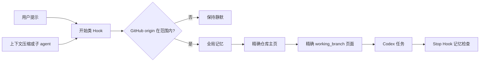

<div align="center">

# Codex Obsidian Memory

**面向 Codex 的本地优先、分支感知长期记忆，由 Obsidian 组织。**

[](https://github.com/Wang-Ruibin/codex-obsidian-memory/actions/workflows/ci.yml)
[](LICENSE)
[](https://www.python.org/)

[English](README.md) · **简体中文** · [构建案例](docs/zh-CN/case-study.md) · [安全策略](SECURITY.zh-CN.md)

</div>

Codex Obsidian Memory 将普通 Markdown 知识库变成持久项目上下文。生命周期 Hook 会在任务前加载正确笔记，在上下文压缩和子 agent 启动后重新加载，并在任务结束前要求进行一次精简的长期记忆检查。

无需向量数据库，无需云端记忆服务，也不应在知识库中保存凭据。

> [!IMPORTANT]
> 当前是早期公开版本。迁移现有知识库前请先备份，并在信任前通过 `/hooks` 审阅每条命令。

## 为什么需要它

- **本地优先：**记忆保存在你拥有的 Markdown 文件中。
- **仓库范围：**精确 GitHub `origin` 决定准入，普通目录保持静默。
- **分支感知：**只加载 `working_branch` 与当前 checkout 精确匹配的页面。
- **图谱友好：**一个仓库、一个文件夹、一个项目主页，分支页归属于该主页。
- **选择性保留：**保存决策、结果、可复用失败经验和下一步，不保存对话流水账。
- **可逆：**停用或卸载不会删除知识库。
- **轻依赖：**运行时只使用 Python 标准库。

## 快速开始

### 要求

- Codex CLI 或 ChatGPT 桌面端中的 Codex。目前 IDE 扩展不支持插件安装。
- Python 3.11+；macOS/Linux 使用 `python3`，Windows 使用 `py.exe`。
- 带 GitHub `origin` 的 Git 仓库。
- 推荐使用 Obsidian 浏览图谱；运行时只处理普通 Markdown。

### 1. 安装

```bash
codex plugin marketplace add Wang-Ruibin/codex-obsidian-memory
codex plugin add codex-obsidian-memory@codex-obsidian-memory
```

安装后新开一个 Codex 会话。

### 2. 创建知识库

向 Codex 输入：

```text
使用 $codex-obsidian-memory，为 GitHub owner my-account
在 D:\absolute\path\to\memory 初始化简体中文知识库。
```

简体中文使用 `--locale zh-CN`；英文 `en` 是默认值。

### 3. 信任并验证

1. 打开 `/hooks`，审阅并信任四条插件命令。
2. 在符合范围的 GitHub 仓库中新开会话。
3. 运行 `$codex-obsidian-memory status`，然后运行 `$codex-obsidian-memory validate`。

健康状态要求：必需笔记无缺失、项目主页无重复、分支身份无重复、Wiki 链接无断链、无孤立节点。

## 工作原理



```text
记忆首页 ── 全局记忆 / 维护 / 模板
    │
    └── 项目总览 ── 仓库主页 ── 精确分支页
```

详见[结构参考](plugins/codex-obsidian-memory/skills/codex-obsidian-memory/references/zh-CN/structure.md)。

## 仓库范围

| 工作区 | 默认行为 |
|---|---|
| 已配置 owner 的已登记仓库 | 加载全局记忆、项目主页和精确分支页 |
| 已配置 owner 的新仓库 | 加载全局记忆、项目总览和模板；仅在产生持久上下文时登记 |
| 显式包含的 `OWNER/REPO` | 在自动 owner 范围外仍加载 |
| 显式排除的 `OWNER/REPO` | 保持静默 |
| 本地仓库、其他 Git 平台或普通目录 | 保持静默 |
| 知识库自身 | 加载维护上下文 |

仓库身份通过非修改性 Git 命令读取。SSH 凭据、私钥、令牌和 Git 配置秘密不会读入记忆。

## 命令

```text
status                         显示配置和知识库健康状态
enable / disable               切换自动行为，不删除数据
include OWNER/REPO             显式包含仓库
exclude OWNER/REPO             显式排除仓库
validate                       检查结构、身份和图谱链接
uninstall                      删除插件状态及其添加的 writable root
```

`uninstall` 永远不会删除或移动知识库。之后可删除插件包：

```bash
codex plugin remove codex-obsidian-memory@codex-obsidian-memory
```

## 接管现有知识库

使用 `--no-template` 与可重复的 `--path KEY=RELATIVE_PATH` 映射，不要覆盖已有布局。所有路径必须保持在知识库内部。详见[迁移文档](plugins/codex-obsidian-memory/skills/codex-obsidian-memory/references/zh-CN/migration.md)。

## 可选周期任务

周报和月检默认关闭。Windows 用户审阅后运行：

```powershell
powershell -ExecutionPolicy Bypass -File plugins/codex-obsidian-memory/scripts/install-windows-tasks.ps1
```

成功的 ISO 周/月会去重；失败不推进状态。月检只能建议归档，不得自动删除、移动或归档笔记。

## 故障排查与限制

- **Hook 静默：**运行 `status`，确认 GitHub `origin` 并检查排除项。
- **Hook 已安装但被跳过：**在 `/hooks` 中信任，然后新开会话。
- **分支上下文错误：**检查 `git branch --show-current` 和精确 `working_branch` frontmatter。
- Detached HEAD 没有精确分支页。
- 秘密遮蔽是纵深防御，不是完整秘密扫描器。
- 周期报告要求机器具有可用的非交互 Codex 登录。

## 安全与来源

插件把所有笔记解析在配置的知识库内部，注入前遮蔽常见秘密模式，并且只移除 Setup 记录为自己添加的 writable root。请阅读[安全策略](SECURITY.zh-CN.md)。

本仓库包装了一次真实知识库的三天端到端构建。设计决策、纠错过程和已验证快照见[构建案例](docs/zh-CN/case-study.md)。

## 开发

```bash
python -m unittest discover -s tests -v
python plugins/codex-obsidian-memory/scripts/memoryctl.py --help
```

英文和简体中文文档应保持结构一致。参见[贡献指南](CONTRIBUTING.zh-CN.md)。

## 许可证

[MIT](LICENSE)。版权所有 © 2026 Wang-Ruibin；公开开发者显示名为 `misakimei0331`。
